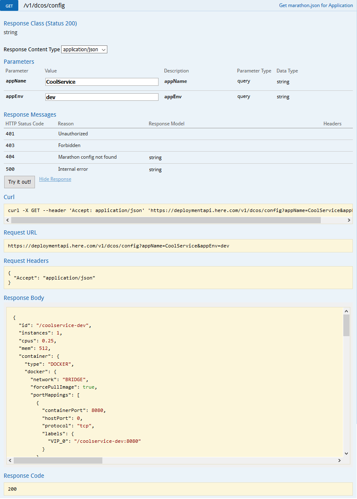
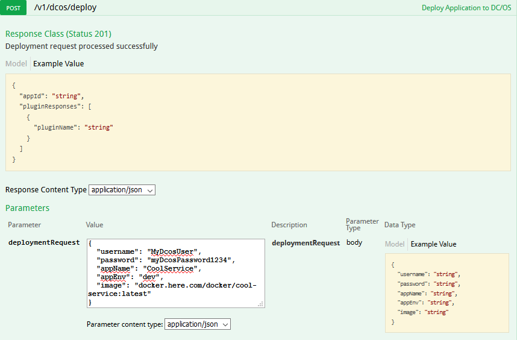
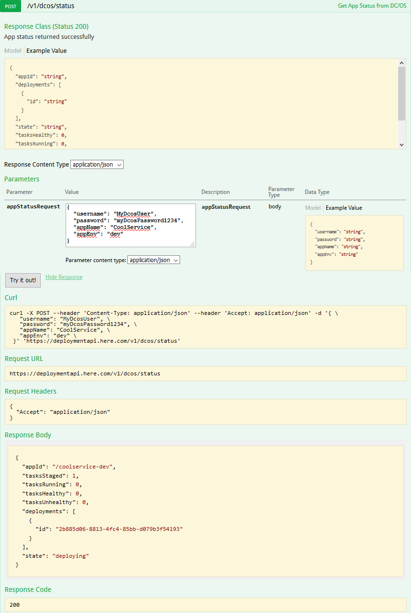
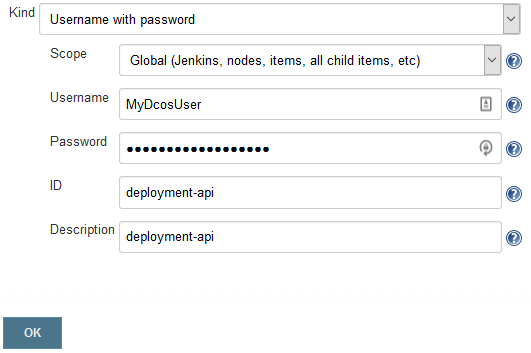

# DC/OS Deployment API Service

Copyright (c) 2017 HERE Europe B.V

A REST service which integrates with Git to provide a hierarchical, source control-backed YAML model for managing deployment configuration for [DC/OS](https://docs.mesosphere.com/1.10/overview/what-is-dcos). DevOps engineers within HERE use this service to configure global, application, and environmental settings for "bundles" of an application and its environments, e.g. *MyService-dev*, *MyService-uat*, *MyService-prod*.

# Table of contents
1. [Introduction](#introduction)
1. [Setup](#setup)
1. [Concepts](#concepts)
1. [Inheritance Hierarchy](#inheritance-hierarchy)
1. [Secrets](#secrets)
1. [Label Templates](#label-templates)
1. [Service Deployments](#service-deployments)
1. [Swagger UI](#swagger-ui)
1. [Jenkins Pipeline Integration](#jenkins-pipeline-integration)
1. [Troubleshooting](#troubleshooting)
1. [YAML Model](#yaml-model)
1. [Plugins](#plugins)

Introduction
---

Deployment API is a front-end for DC/OS service creation. It allows Ops to control all deployment properties while allowing for self-service deployments from CI tools like Jenkins without exposing credential configuration or the heavy lifting required to correctly deploy DC/OS services. The configuration files are stored in Git in YAML format, so all deployment configuration changes are appropriately tracked in source control and can be easily reviewed. Deployment configuration is transformed from the YAML model to the [Marathon API format](https://dcos.io/docs/1.9/deploying-services/marathon-api/) and sent to DC/OS automatically.

Setup
---
 	
*Full deployment/setup instructions are currently pending legal approval of the release on hub.docker.com.* 

Concepts
---

The core concept is best demonstrated using an example. All deployment configuration lives inside YAML files stored in a Git repo. For an application called "MyService" with 2 environments (`dev`, `prod`), you'd create a bundle of deployment configuration YAML files inside your backing Git repo. At deployment time, these files are merged into a single YAML model, transformed into the [Marathon API format](https://dcos.io/docs/1.9/deploying-services/marathon-api/), and then sent to DC/OS.

```
<repo_root>/application-global.yml		# global settings, applies to all deployments
<repo_root>/MyService/MyService-deploy.yml	# application settings, applies to all MyService deployments (dev, prod)
<repo_root>/MyService/MyService-deploy-dev.yml	# environment settings, applies only to MyService dev deployments
<repo_root>/MyService/MyService-deploy-prod.yml	# environment settings, applies only to MyService prod deployments
```

The Deployment API model requires an `appName` and `appEnv` to arrange deployment properties by application and environment. In the above example, the `appName` is *MyService* and the `appEnv` could be `dev` or `prod`.

*application-global.yml* contains global settings for all applications. These will be inherited by every deployment unless overridden:

```yaml
marathon:
  url: https://dcos-internal.mycompany.com
  container:
    type: DOCKER
    docker:
      forcePullImage: true
      network: BRIDGE

global:
  docker:
    parameters:
      -
        key: log-driver
        value: syslog
      -
        key: log-opt
        value: syslog-address=tcp://logstash-shipper.mycompany.com:514
      -
        key: log-opt
        value: syslog-format=rfc3164       
```

*MyService-deploy.yml* contains settings for all *MyService* environments:

```yaml
marathon:
  mem: 512.0
  upgradeStrategy:
    minimumHealthCapacity: 0.5
    maximumOverCapacity: 0.2
  healthChecks:
    -
      protocol: MESOS_HTTP
      path: /
      portIndex: 0
      gracePeriodSeconds: 300
      intervalSeconds: 30
      timeoutSeconds: 20
      maxConsecutiveFailures: 3
  secrets:
    -
      name: DCOS_SECRET		# local secret name reference
      source: my-dcos-secret	# name of DC/OS Secret
application:
  env:
    -
      key: JAVA_OPTS
      value: -Xmx512m
    -
      key: DEPLOYMENT_SECRET	# environment variable name/key
      secret: DCOS_SECRET	# local secret name reference
  labels:
    -
      key: HAPROXY_GROUP
      value: external
    -
      key: HAPROXY_0_REDIRECT_TO_HTTPS
      value: 'true'
    -
      key: HAPROXY_0_STICKY
      value: 'true'                         
```

*MyService-deploy-dev.yml* contains settings for only *MyService-dev* environments:

```yaml
marathon:
  appId: /myservice-dev
  instances: 1
  cpus: 0.25      
  container:
    docker:
      portMappings:
        -
          containerPort: 8080
          hostPort: 0
          protocol: tcp
          labels:
            -
              key: VIP_0
              value: /myservice-dev:8080
        -
          containerPort: 9096
          hostPort: 9096
          protocol: tcp          
          labels:
            -
              key: VIP_1
              value: /myservice-dev:9096
environment:
  env:
    - 
      key: DEPLOYMENT_ENV
      value: development 
  docker:
    parameters:
      -
        key: log-opt
        value: tag=myservice-dev/{{.ID}}
  labels:
    -
      key: HAPROXY_0_VHOST
      value: myservice-dev.mycompany.com        
```

When a deployment to the `dev` environment is initiated, Deployment API merges the 3 YAML configuration files and transforms the merged configuration into the familiar [Marathon API format](https://dcos.io/docs/1.9/deploying-services/marathon-api/):

```json
{
  "id": "/myservice-dev",
  "instances": 1,
  "cpus": 0.25,
  "mem": 512.0,
  "container": {
    "type": "DOCKER",
    "docker": {
      "network": "BRIDGE",
      "forcePullImage": true,
      "portMappings": [
        {
          "containerPort": 8080,
          "hostPort": 0,
          "protocol": "tcp",
          "labels": {
            "VIP_0": "/myservice-dev:8080"
          }
        },
        {
          "containerPort": 9096,
          "hostPort": 9096,
          "protocol": "tcp",
          "labels": {
            "VIP_1": "/myservice-dev:9096"
          }
        }
      ],
      "parameters": [
        {
          "key": "log-driver",
          "value": "syslog"
        },
        {
          "key": "log-opt",
          "value": "syslog-address=tcp://logstash-shipper.mycompany.com:514"
        },
        {
          "key": "log-opt",
          "value": "syslog-format=rfc3164"
        },
        {
          "key": "log-opt",
          "value": "tag=myservice-dev/{{.ID}}"
        }
      ]
    }
  },
  "env": {
    "DEPLOYMENT_SECRET": {
      "secret": "DCOS_SECRET"
    },
    "DEPLOYMENT_ENV": "development",    
    "JAVA_OPTS": "-Xmx512m"
  },
  "secrets": {
    "DCOS_SECRET": {
      "source": "my-dcos-secret"
    }
  },
  "labels": {
    "HAPROXY_0_VHOST": "myservice-dev.mycompany.com",
    "HAPROXY_0_REDIRECT_TO_HTTPS": "true",
    "HAPROXY_GROUP": "external",
    "HAPROXY_0_STICKY": "true"
  },
  "healthChecks": [
    {
      "gracePeriodSeconds": 300,
      "intervalSeconds": 30,
      "maxConsecutiveFailures": 3,
      "portIndex": 0,
      "timeoutSeconds": 20,
      "ignoreHttp1xx": false,
      "path": "/",
      "protocol": "MESOS_HTTP"
    }
  ],
  "upgradeStrategy": {
    "minimumHealthCapacity": 0.5,
    "maximumOverCapacity": 0.2
  }
}
```

*MyService-deploy-prod.yml* and its corresponding transformation follow the same ideas:

```yaml
marathon:
  appId: /myservice-prod
  instances: 5
  cpus: 1  
  container:
    docker:
      portMappings:
        -
          containerPort: 8080
          hostPort: 0
          protocol: tcp
          labels:
            -
              key: VIP_0
              value: /myservice-prod:8080
        -
          containerPort: 9096
          hostPort: 9096
          protocol: tcp          
          labels:
            -
              key: VIP_1
              value: /myservice-prod:9096
environment:
  env:
    - 
      key: DEPLOYMENT_ENV
      value: production 
  docker:
    parameters:
      -
        key: log-opt
        value: tag=myservice-prod/{{.ID}}
  labels:
    -
      key: HAPROXY_0_VHOST
      value: myservice-prod.mycompany.com         
```


```json
{
  "id": "/myservice-prod",
  "instances": 5,
  "cpus": 1,
  "mem": 512.0,
  "container": {
    "type": "DOCKER",
    "docker": {
      "network": "BRIDGE",
      "forcePullImage": true,
      "portMappings": [
        {
          "containerPort": 8080,
          "hostPort": 0,
          "protocol": "tcp",
          "labels": {
            "VIP_0": "/myservice-prod:8080"
          }
        },
        {
          "containerPort": 9096,
          "hostPort": 9096,
          "protocol": "tcp",
          "labels": {
            "VIP_1": "/myservice-prod:9096"
          }
        }
      ],
      "parameters": [
        {
          "key": "log-driver",
          "value": "syslog"
        },
        {
          "key": "log-opt",
          "value": "syslog-address=tcp://logstash-shipper.mycompany.com:514"
        },
        {
          "key": "log-opt",
          "value": "syslog-format=rfc3164"
        },
        {
          "key": "log-opt",
          "value": "tag=myservice-prod/{{.ID}}"
        }
      ]
    }
  },
  "env": {
    "DEPLOYMENT_SECRET": {
      "secret": "DCOS_SECRET"
    },
    "DEPLOYMENT_ENV": "production",    
    "JAVA_OPTS": "-Xmx512m"
  },
  "secrets": {
    "DCOS_SECRET": {
      "source": "my-dcos-secret"
    }
  },
  "labels": {
    "HAPROXY_0_VHOST": "myservice-prod.mycompany.com",
    "HAPROXY_0_REDIRECT_TO_HTTPS": "true",
    "HAPROXY_GROUP": "external",
    "HAPROXY_0_STICKY": "true"
  },
  "healthChecks": [
    {
      "gracePeriodSeconds": 300,
      "intervalSeconds": 30,
      "maxConsecutiveFailures": 3,
      "portIndex": 0,
      "timeoutSeconds": 20,
      "ignoreHttp1xx": false,
      "path": "/",
      "protocol": "MESOS_HTTP"
    }
  ],
  "upgradeStrategy": {
    "minimumHealthCapacity": 0.5,
    "maximumOverCapacity": 0.2
  }
}
```

Inheritance Hierarchy
---

Properties underneath the `marathon.*` namespace can be overridden by hierarchy: `environment` overrides `application` overrides `global`. For example:

*application-global.yml* (global):

```yaml
marathon:
  instances: 1
  cpus: 0.25
  ...  
```

*MyService-deploy.yml* (application):

```yaml
marathon:
  instances: 3
  cpus: 0.5
  mem: 512.0
  ...  
```

*MyService-deploy-dev.yml* (environment):

```yaml
marathon:
  appId: /myservice-dev
  instances: 5
  cpus: 1
  ...  
```

When these are merged at deployment time, the `instances` and `cpus` settings defined by *MyService-deploy-dev.yml* would override both the application and global settings, and the service would deploy with `instances: 5` , `cpus: 1` , `mem: 512.0`. If *MyService-deploy-dev.yml* didn't define anything for these settings:

```yaml
marathon:
  appId: /myservice-dev
  ...  
```

The deployment would inherit from *MyService-deploy.yml* `instances: 3` , `cpus: 0.5` , `mem: 512.0`

#### Merging Lists

**Lists underneath the marathon.* namespace are not merged.** For example:

*MyService-deploy.yml* (application):

```yaml
marathon:   
  container:
    docker:
      portMappings:
        -
          containerPort: 8080
          hostPort: 0
          protocol: tcp
          labels:
            -
              key: VIP_0
              value: /myservice-dev:8080
```

*MyService-deploy-dev.yml* (environment):

```yaml
marathon:   
  container:
    docker:
      portMappings:              
        -
          containerPort: 9096
          hostPort: 9096
          protocol: tcp          
          labels:
            -
              key: VIP_1
              value: /myservice-dev:9096
```

The merged deployment would **only** contain the `portMapping` labeled `VIP_1`, the the portMapping from *MyService-deploy.yml* would not be included.

If the `marathon.*` namespace lists were allowed to be merged, there would be no way to exclude list items from another file. Thus, Deployment API provides a structure for defining merged lists of the three most common merged list items: environment variables, docker parameters and labels. For example:

*application-global.yml* (global):

```yaml
global:
  env:
    - 
      key: GLOBAL_ENV_VAR
      value: global-var
  docker:
    parameters:
      -
        key: log-driver
        value: tag=syslog
  labels:
    - 
      key: GLOBAL_LABEL
      value: global-label
```

*MyService-deploy.yml* (application):

```yaml
application:
  env:
    - 
      key: APPLICATION_ENV_VAR
      value: application-var
  docker:
    parameters:
      -
        key: log-opt
        value: syslog-format=rfc3164  
  labels:
    - 
      key: APPLICATION_LABEL
      value: application-label
```

*MyService-deploy-dev.yml* (environment):

```yaml   
environment:
  env:
    - 
      key: ENVIRONMENT_ENV_VAR
      value: environment-var
  docker:
    parameters:
      -
        key: log-opt
        value: tag=mytag
  labels:
    - 
      key: ENVIRONMENT_LABEL
      value: environment-label
```

Would produce the following merged JSON:

```json
{
  ...
  "container": {
    "docker": {
      "parameters": [
        {
          "key": "log-driver",
          "value": "syslog"
        },
        {
          "key": "log-opt",
          "value": "syslog-format=rfc3164"
        },
        {
          "key": "log-opt",
          "value": "tag=mytag"
        }
      ]
    }
  },
  "env": {
    "GLOBAL_ENV_VAR": "global-var",    
    "APPLICATION_ENV_VAR": "application-var",
    "ENVIRONMENT_ENV_VAR": "environment-var"
  },
  "labels": {
    "GLOBAL_LABEL": "global-label",
    "APPLICATION_LABEL": "application-label",
    "ENVIRONMENT_LABEL": "environment-label"
  },
  ...
}
```

#### Excluding List Values

To exclude the values from another file from being merged, we just define the list with no values. For example, if using the same example as above except with *MyService-deploy-dev.yml* (environment) defined like:

```yaml   
environment:
  env:
    - 
      key: ENVIRONMENT_ENV_VAR
      value: environment-var
  docker:
    parameters:
      -
        key: log-opt
        value: tag=mytag
  labels:
    - 
      key: ENVIRONMENT_LABEL
      value: environment-label
global:
  env:
  docker:
    parameters:
  labels:
application:
  env:
  docker:
    parameters:
  labels:          
```

The merged JSON would not include anything from *application-global.yml* or *MyService-deploy.yml*:

```json
{
  ...
  "container": {
    "docker": {
      "parameters": [
        {
          "key": "log-opt",
          "value": "tag=mytag"
        }
      ]
    }
  },
  "env": {
    "ENVIRONMENT_ENV_VAR": "environment-var"
  },
  "labels": {
    "ENVIRONMENT_LABEL": "environment-label"
  },
  ...
}
```
 
Secrets
---

Secrets are supported using a similar model to the native JSON. First, define the secret with a name and source. "Source" refers to the DC/OS secret key, "name" is the local reference to the secret.

```yaml  
marathon:
  secrets:
    -
      name: DCOS_SECRET		# local secret name reference
      source: my-dcos-secret	# name of DC/OS Secret
```

Then add the secret to the environment:
      
```yaml    
application:
  env:
    -
      key: DEPLOYMENT_SECRET	# environment variable name/key
      secret: DCOS_SECRET	# local secret name reference
```

Produces:

```json
{
  ...
  "env": {
    "DEPLOYMENT_SECRET": {
      "secret": "DCOS_SECRET"
    }
  },
  "secrets": {
    "DCOS_SECRET": {
      "source": "my-dcos-secret"
    }
  },
  ...
}
```


Label Templates
---
Deployment API provides functionality to template difficult to manage strings in labels. There are two built-in label templates to facilitate integration with HAProxy, and it is simple to add custom templates.

#### `haproxy_backend_health`

```yaml
environment:
  labels:
    -
      key: HAPROXY_0_BACKEND_HTTP_HEALTHCHECK_OPTIONS
      template: haproxy_backend_health
      args:
        - myhost.com           
```

```json
}
  ...
  "labels": {
    "HAPROXY_0_BACKEND_HTTP_HEALTHCHECK_OPTIONS": "option httpchk GET {healthCheckPath} HTTP/1.1\\\\r\\\\nHost:\\\\ myhost.com\\n",
  } 
  ...
}  
```

#### `haproxy_backend_head`

```yaml
environment:
  labels:
    -
      key: HAPROXY_0_BACKEND_HEAD
      template: haproxy_backend_head
      args:
        - 300s         
```

```json
}
  ...
  "labels": {
    "HAPROXY_0_BACKEND_HEAD": "backend {backend}\\r\\n balance {balance}\\r\\n mode {mode}\\r\\n timeout server 300s\\r\\n timeout client 300s\\r\\n",
  } 
  ...
}  
```

### Custom Label Templates
To define custom label templates, add *DeploymentApiService.yml* to your backing Git repo in the following location:

```
<repo_root>/DeploymentApiService/DeploymentApiService.yml
```

With the definition of your template as `my_label_template_name`:

```yaml
deployment:  
  label:
    template:
      user:
        my_label_template_name: my template {0}
```

Then restart Deployment API service and refer to your new template:

```yaml
environment:
  labels:
    -
      key: LABEL_NAME
      template: my_label_template_name
      args:
        - myArg         
```

And this will produce:

```json
}
  ...
  "labels": {
    "LABEL_NAME": "my template myArg",
  } 
  ...
}  
```

Service Deployments
---

Service deployment requires 5 arguments:
* username: Username for DC/OS. This user must have the appropriate permissions set up to create services via the API. Typically a service account user.
* password: Password for DC/OS user.
* appName: The application name referenced in the YAML files (see [Concepts](#concepts))
* appEnv: The application environment referenced in the YAML files (see [Concepts](#concepts))
* image: Docker image being deployed.

Simply POST to the service created in [Setup](#setup):

```
curl -X POST --header 'Content-Type: application/json' --header 'Accept: application/json' -d '{ \ 
   "username": "MyDcosUsername", \ 
   "password": "myDcosPassword1234!", \ 
   "appName": "MyService", \ 
   "appEnv": "dev", \ 
   "image": "docker.mycompany.com/my-service:latest" \ 
 }' 'https://deploymentapi.mycompany.com/v1/dcos/deploy'
```

If successful, returns `201 Created` with the appId:

```json
{
  "appId": "/myservice-dev"
}
```

One can then poll for the status until `state: deployed`

```
curl -X POST --header 'Content-Type: application/json' --header 'Accept: application/json' -d '{ \ 
   "username": "MyDcosUsername", \ 
   "password": "myDcosPassword1234!", \ 
   "appName": "MyService", \ 
   "appEnv": "dev" \ 
 }' 'https://deploymentapi.mycompany.com/v1/dcos/status
```

```json
{
  "appId": "/myservice-dev",
  "tasksStaged": 1,
  "tasksRunning": 0,
  "tasksHealthy": 0,
  "tasksUnhealthy": 0,
  "deployments": [
    {
      "id": "a5d121b4-7885-4941-badf-846a0b2df995"
    }
  ],  
  "state": "deploying"
}
```

...and then once the app is finally deployed...

```json
{
  "appId": "/myservice-dev",
  "tasksStaged": 0,
  "tasksRunning": 1,
  "tasksHealthy": 1,
  "tasksUnhealthy": 0,
  "deployments": [],
  "state": "deployed"
}
```

Swagger UI
---

Pointing your web browser at the service created in [Setup](#setup) will display a Swagger UI page for interacting with the three functions Deployment API provides.

---

#### GET - /v1/dcos/config

Returns the YAML model transformed to [Marathon API format](https://dcos.io/docs/1.9/deploying-services/marathon-api/) for the given appName and appEnv. Useful for debugging.



---

#### POST - /v1/dcos/deploy

Deploy the provided Docker image to DC/OS using configuration provided by appName and appEnv.



----

#### POST - /v1/dcos/status

Retrieve deployment status for provided appName and appEnv from DC/OS.



---

Jenkins Pipeline Integration
---

[Jenkins Pipelines](https://jenkins.io/doc/book/pipeline/syntax/) are supported with a [shared library](https://jenkins.io/doc/book/pipeline/shared-libraries/) (requires [Credentials Plugin](https://wiki.jenkins.io/display/JENKINS/Credentials+Plugin))

First, create a new Credential with the ID 'deployment-api'. This is your DC/OS user which has the appropriate permissions to create services.



Copy the example jenkins-pipeline from the [deployment-api examples](https://github.com/heremaps/deployment-api/tree/master/examples/jenkins-pipeline) to a repository of your choice. For example: [https://github.com/micahnoland/deployment-api-jenkins](https://github.com/micahnoland/deployment-api-jenkins)

And then add the following to the top of your Jenkinsfile:

```groovy
@Library('github.com/micahnoland/deployment-api-jenkins@master') _
```

Your Jenkins Pipeline can then call the `deploymentApi(appName, appEnv, image)` method to initiate the deployment. `deploymentApi()` will attempt to deploy the application, and then block for up to 10 minutes while polling for deployment status. Once the deployment status is 'deployed', the method exits successfully. If 10 minutes of status polling elapse without receiving a 'deployed' status, the method throws an exception.

Here is a sample Jenkinsfile for reference:

```groovy
#!/usr/bin/env groovy
@Library('github.com/micahnoland/deployment-api-jenkins@master') _

pipeline {
  environment {
  	DEPLOYMENT_API_APP_NAME = 'CoolService'
  	DEPLOYMENT_API_URL = 'https://deploymentapi.mycompany.com' 
  }
  stages {
    stage ('Build') {
  	// run build, create Docker image, etc.
  	env.DOCKER_IMAGE = ...
    }      
    stage ('Deploy to Dev') {
      steps {
      	script {
      	  deploymentApi(env.DEPLOYMENT_API_APP_NAME, 'dev', "${DOCKER_IMAGE}") )
      	}
      }
    }
  }    
}
```

Troubleshooting
---

#### HTTP Status 409

`409 - Conflict` is returned if Marathon already has an App running with the same id and Docker image. For example, if [Marathon already has an App](https://mesosphere.github.io/marathon/docs/rest-api.html#user-content-get-v2apps) with id `/myservice-dev` running `docker.mycompany.com/docker/my-service:latest` as in:

```json
{
	"apps": [
		{
		    "id": "/myservice-dev",
		    "container": {
		        "docker": {
		            "image": "docker.mycompany.com/docker/my-service:latest",
		            ... 
		        }
		        ...
		    }
		    ...
		}
	]
}		
```

Then trying to deploy `docker.mycompany.com/docker/my-service:latest` to `/myservice-dev` again will return `409 - Conflict`. To work around this, in the short term, destroy the service manually in DC/OS and then re-deploy. In the long-term, configure your deployment pipeline to give a unique tag to your Docker image for each build, as in `docker.mycompany.com/docker/my-service:1.0.67`.

#### HTTP Status 403

`403 - Forbidden` is returned if the credentials provided by `"username"` and `"password"` does not have access to deploy to the given id. 


YAML Model
---

```yaml
marathon:
  url: 
  appId:  
  instances:
  cpus: 
  mem:
  container:
    type: 
    docker:
      forcePullImage: 
      network: 
      portMappings:
        -
          containerPort:
          hostPort:
          servicePort:
          protocol:     
          labels:
            -
              key:
              value:
    volumes:
      -
        containerPath: 
        hostPath: 
        mode:            
        id:
        status:
        type:
        name:
        provider:
        options:
          -
            key:
            value: 
  upgradeStrategy:
    minimumHealthCapacity:
    maximumOverCapacity:
  healthChecks:
    -
      protocol: 
      portIndex: 
      gracePeriodSeconds: 
      path: 
      intervalSeconds: 
      timeoutSeconds:
      maxConsecutiveFailures:
      ignoreHttp1xx: 
  secrets:
    -
      name: 
      source:  
  fetch:
    -
      uri:       
  constraints: 
    -
      attribute: 
      operator: 
      value:       
          
# parameters which will apply to all deployments. Should live in application-global.yml          
global:
  docker:
    parameters:
      -
        key: 
        value:
  env:
    - 
      key: 
      value: 
    -
      key: 
      secret: 
  labels:
    -
      key: 
      value: 
    -
      key:
      template: 
      args:
        -       
         
# parameters which will apply to all deployments for this appName. Should live in {appName}/{appName}-deploy.yml      
application:
  docker:
    parameters:
      -
        key:
        value:
  env:
    - 
      key: 
      value: 
    -
      key: 
      secret: 
  labels:
    -
      key: 
      value: 
    -
      key:
      template: 
      args:
        -       

# parameters which will apply to deployments for this appName and appEnv. Should live in {appName}/{appName}-deploy-{appEnv}.yml         
environment:        
  docker:
    parameters:
      -
        key:
        value:
  env:
    - 
      key: 
      value: 
    -
      key: 
      secret:
       environment:
  labels:
    -
      key: 
      value: 
    -
      key:
      template: 
      args:
        - 
```

Plugins
---


It is possible to create custom plugins which can send arbitrary payloads to various services at deployment time, to facilitate deployment orchestration. For example, when an application is deployed, some HERE Technologies users require a JSON payload to be sent to an external [Etcd](https://github.com/coreos/etcd) service to enable [DataDog](https://github.com/DataDog) monitoring of the Docker containers. These payloads live inside the same Git repo as deployment configuration for maximum convenience:

```
<repo_root>/application-global.yml	
<repo_root>/MyService/MyService-deploy.yml
<repo_root>/MyService/MyService-deploy-dev.yml	
<repo_root>/MyService/MyService-deploy-prod.yml
<repo_root>/MyService/MyService-etcd-dev.yml
<repo_root>/MyService/MyService-etcd-prod.yml
```

The deployment-api-datadog-plugin project is provided as an example. Familiarity with [Spring Boot](https://docs.spring.io/spring-boot/docs/current/reference/html/using-boot-auto-configuration.html) is required.